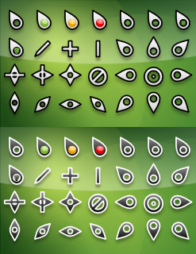

# What is this?
This is a fork of the "Gruppled cursors" by [Craig Laparo](https://www.gnome-look.org/u/gruppler)

# What did I do?
I added some missing links and modified a few curors, **only** of the dark variant tho. I put the modified pngs and configs in the sources folder

# How to install?
1. Clone the repo
2. Copy the `gruppled_white` and `gruppled_black` directories to one of the theme directories. [What does that means?](https://wiki.archlinux.org/title/Cursor_themes#Manually)

# Will I improve/maintain this in the future?
`¯\_(ツ)_/¯`

I don't really care, I made this mostly for personal use

# Original description:
*Note: preview out of date*
___

# Gruppled Cursors

GPL v2 Cursor themes by [Craig Laparo](https://www.gnome-look.org/u/gruppler) re-uploaded on github for easier access.
Initially available at https://www.gnome-look.org/p/999974

See also: [Gruppled Lite Cursors](https://github.com/nim65s/gruppled-lite-cursors)
